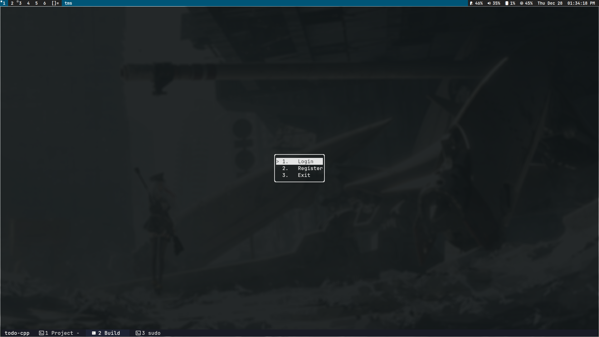
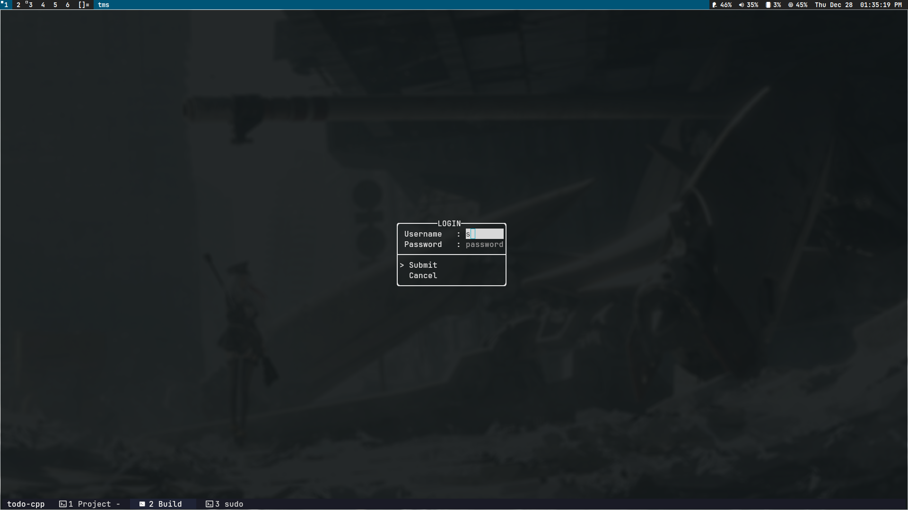

<h1 align="center">TODO Application in C++</h3>

    - [x] Login and Registration
    - [ ] Todo

## Libraries used
- [libpqxx](https://github.com/jtv/libpqxx)
- [ftxui](https://github.com/ArthurSonzogni/FTXUI)

## Images

